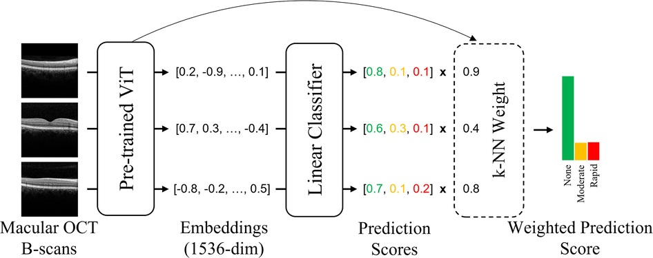

##### Download

+ [PDF](glauc.pdf)
<!-- + [Online appendix](appendix1.pdf) -->
<!-- + [Code and data](https://github.com/notjonhuang/***) -->

---

##### Overview of the classification pipeline.



---

##### Abstract


Précis: 

A deep learning model trained on macular OCT imaging studies detected clinically significant functional glaucoma progression and was also able to predict future progression.

Objective: 

To use macular optical coherence tomography (OCT) imaging to predict the future and detect concurrent visual field progression, respectively, using deep learning.

Design: 

A retrospective cohort study.

Subjects: 

A pretraining data set was comprised of 7,702,201 B-scan images from 151,389 macular OCT studies. The progression detection task included 3902 macular OCT imaging studies from 1534 eyes of 828 patients with glaucoma, and the progression prediction task included 1346 macular OCT studies from 1205 eyes of 784.

Methods: 

A novel deep learning method was developed to detect glaucoma progression and predict future progression using macular OCT, based on self-supervised pretraining of a vision transformer (ViT) model on a large, unlabeled data set of OCT images. Glaucoma progression was defined as a mean deviation (MD) rate of change of ≤ −0.5 dB/year over 5 consecutive Humphrey visual field tests, and rapid progression was defined as MD change ≤ −1 dB/year.

Main Outcome Measures: 

Diagnostic performance of the ViT model for prediction of future visual field progression and detection of concurrent visual field progression using area under the receiver operating characteristic curve (AUC), sensitivity, and specificity.

Results: 

The model distinguished stable eyes from progressing eyes, achieving an AUC of 0.90 (95% CI, 0.88–0.91). Rapid progression was detected with an AUC of 0.92 (95% CI, 0.91–0.93). The model also demonstrated high predictive ability for forecasting future glaucoma progression, with an AUC of 0.85 (95% CI 0.83–0.87). Rapid progression was predicted with an AUC of 0.84 (95% CI 0.81–0.86).

Conclusions: 

A deep learning model detected clinically significant functional glaucoma progression using macular OCT imaging studies and was also able to predict future progression. Early identification of patients undergoing glaucoma progression or at high risk for future progression may aid in clinical decision-making.


---

##### Citation
Huang, Jonathan, Galal, Galal, Mukhin, Vladislav, Etemadi, Mozziyar, Tanna, Angelo P. Prediction and Detection of Glaucomatous Visual Field Progression Using Deep Learning on Macular Optical Coherence Tomography. Journal of Glaucoma 33(4):p 246-253, April 2024. https://doi.org/10.1097/IJG.0000000000002359 

<!-- 
```BibTeX
@article{AAYY,
author = {Author 1 and Author 2},
doi = {paper_doi},
journal = {Journal},
number = {Issue},
pages = {XXX--YYY},
title ={Title},
volume = {Volume},
year = {Year}}
```

---

##### Related material

+ [Presentation slides](presentation2.pdf)
 -->
