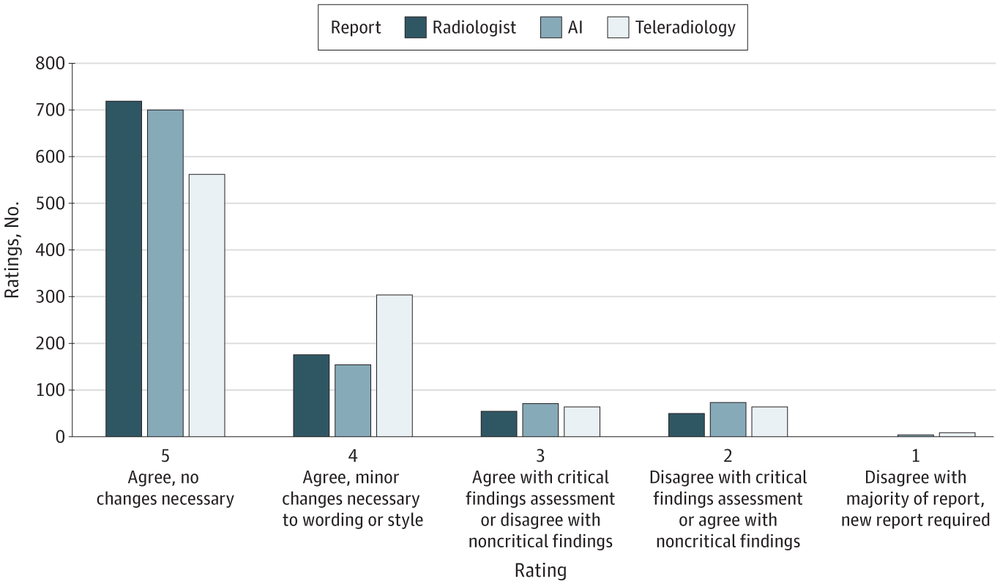

##### Download

+ [PDF](jno2023.pdf)
+ [Online appendix](jno2023_supp.pdf)
<!-- + [Code and data](https://github.com/notjonhuang/***) -->

---

##### Clinical quality rating distribution by emergency physicians



---

##### Abstract

Importance: Multimodal generative artificial intelligence (AI) methodologies have the potential to optimize emergency department care by producing draft radiology reports from input images.

Objective: To evaluate the accuracy and quality of AI–generated chest radiograph interpretations in the emergency department setting.

Design, Setting, and Participants: This was a retrospective diagnostic study of 500 randomly sampled emergency department encounters at a tertiary care institution including chest radiographs interpreted by both a teleradiology service and on-site attending radiologist from January 2022 to January 2023. An AI interpretation was generated for each radiograph. The 3 radiograph interpretations were each rated in duplicate by 6 emergency department physicians using a 5-point Likert scale.

Main Outcomes and Measures: The primary outcome was any difference in Likert scores between radiologist, AI, and teleradiology reports, using a cumulative link mixed model. Secondary analyses compared the probability of each report type containing no clinically significant discrepancy with further stratification by finding presence, using a logistic mixed-effects model. Physician comments on discrepancies were recorded.

Results: A total of 500 ED studies were included from 500 unique patients with a mean (SD) age of 53.3 (21.6) years; 282 patients (56.4%) were female. There was a significant association of report type with ratings, with post hoc tests revealing significantly greater scores for AI (mean [SE] score, 3.22 [0.34]; P < .001) and radiologist (mean [SE] score, 3.34 [0.34]; P < .001) reports compared with teleradiology (mean [SE] score, 2.74 [0.34]) reports. AI and radiologist reports were not significantly different. On secondary analysis, there was no difference in the probability of no clinically significant discrepancy between the 3 report types. Further stratification of reports by presence of cardiomegaly, pulmonary edema, pleural effusion, infiltrate, pneumothorax, and support devices also yielded no difference in the probability of containing no clinically significant discrepancy between the report types.

Conclusions and Relevance: In a representative sample of emergency department chest radiographs, results suggest that the generative AI model produced reports of similar clinical accuracy and textual quality to radiologist reports while providing higher textual quality than teleradiologist reports. Implementation of the model in the clinical workflow could enable timely alerts to life-threatening pathology while aiding imaging interpretation and documentation.

---

##### Citation
Huang J, Neill L, Wittbrodt M, et al. Generative Artificial Intelligence for Chest Radiograph Interpretation in the Emergency Department. JAMA Netw Open. 2023;6(10):e2336100. https://doi.org/10.1001/jamanetworkopen.2023.36100

<!-- 
```BibTeX
@article{AAYY,
author = {Author 1 and Author 2},
doi = {paper_doi},
journal = {Journal},
number = {Issue},
pages = {XXX--YYY},
title ={Title},
volume = {Volume},
year = {Year}}
```

---

##### Related material

+ [Presentation slides](presentation2.pdf)
 -->
