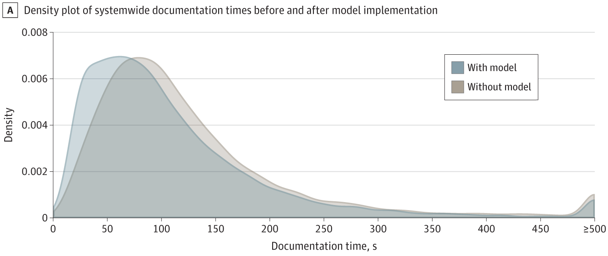

<video width="720" controls autoplay muted>
  <source src="/media/ARIES_animation.mp4" type="video/mp4">
  Your browser does not support the video tag.
</video>

---

##### Download

+ [PDF](paper1.pdf)
+ [Online appendix](appendix1.pdf)
<!-- + [Code and data](https://github.com/notjonhuang/***) -->

---

##### Abstract

Importance: Diagnostic imaging interpretation involves distilling multimodal clinical information into text form, a task well-suited to augmentation by generative artificial intelligence (AI). However, to our knowledge, impacts of AI-based draft radiological reporting remain unstudied in clinical settings.

Objective: To prospectively evaluate the association of radiologist use of a workflow-integrated generative model capable of providing draft radiological reports for plain radiographs across a tertiary health care system with documentation efficiency, the clinical accuracy and textual quality of final radiologist reports, and the model’s potential for detecting unexpected, clinically significant pneumothorax.

Design, Setting, and Participants: This prospective cohort study was conducted from November 15, 2023, to April 24, 2024, at a tertiary care academic health system. The association between use of the generative model and radiologist documentation efficiency was evaluated for radiographs documented with model assistance compared with a baseline set of radiographs without model use, matched by study type (chest or nonchest). Peer review was performed on model-assisted interpretations. Flagging of pneumothorax requiring intervention was performed on radiographs prospectively.

Main Outcomes and Measures: The primary outcomes were association of use of the generative model with radiologist documentation efficiency, assessed by difference in documentation time with and without model use using a linear mixed-effects model; for peer review of model-assisted reports, the difference in Likert-scale ratings using a cumulative-link mixed model; and for flagging pneumothorax requiring intervention, sensitivity and specificity.

Results: A total of 23 960 radiographs (11 980 each with and without model use) were used to analyze documentation efficiency. Interpretations with model assistance (mean [SE], 159.8 [27.0] seconds) were faster than the baseline set of those without (mean [SE], 189.2 [36.2] seconds) (P = .02), representing a 15.5% documentation efficiency increase. Peer review of 800 studies showed no difference in clinical accuracy (χ2 = 0.68; P = .41) or textual quality (χ2 = 3.62; P = .06) between model-assisted interpretations and nonmodel interpretations. Moreover, the model flagged studies containing a clinically significant, unexpected pneumothorax with a sensitivity of 72.7% and specificity of 99.9% among 97 651 studies screened.

Conclusions and Relevance: In this prospective cohort study of clinical use of a generative model for draft radiological reporting, model use was associated with improved radiologist documentation efficiency while maintaining clinical quality and demonstrated potential to detect studies containing a pneumothorax requiring immediate intervention. This study suggests the potential for radiologist and generative AI collaboration to improve clinical care delivery.

---

##### Graph of model-assisted versus non-model interpretations



---

##### Citation
Huang J, Wittbrodt MT, Teague CN, et al. Efficiency and Quality of Generative AI–Assisted Radiograph Reporting. JAMA Netw Open. 2025;8(6):e2513921. https://doi.org/10.1001/jamanetworkopen.2025.13921

<!-- 
```BibTeX
@article{AAYY,
author = {Author 1 and Author 2},
doi = {paper_doi},
journal = {Journal},
number = {Issue},
pages = {XXX--YYY},
title ={Title},
volume = {Volume},
year = {Year}}
```

---

##### Related material

+ [Presentation slides](presentation2.pdf)
 -->
